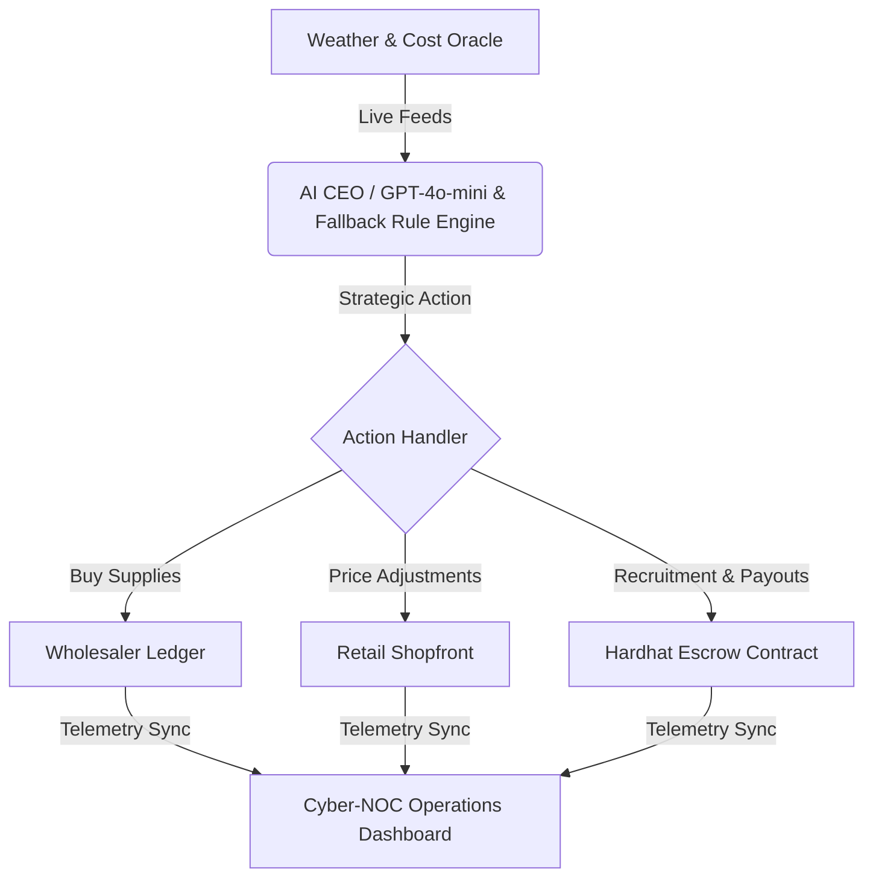

<div align="center">

# 🌌 ATLAS AI

**Autonomous Legal Entity (ALE) Operations Dashboard & Governance Engine**

[](https://nextjs.org)
[](https://prisma.io)
[](https://hardhat.org)
[](https://react.dev)

**An AI-driven business operated entirely on decentralized rails — automated inventory restocking, smart contract escrow payroll, weather oracles, and dynamic consumer pricing.**

*Built for Hack Aarambh 2026 by Team Meridian*

</div>

---

## 📌 What is ATLAS AI?

**ATLAS AI** is a prototype of an **Autonomous Legal Entity (ALE)**. Unlike traditional copilot agents that simply assist human managers, ATLAS AI represents the **business itself** — functioning as the automated "CEO" that makes pricing, inventory, hiring, and payroll decisions on decentralized rails. 

To demonstrate this concept, we simulated a micro-economy: a **Lemonade Stand** operated entirely by AI:
1. ☀️ **Oracle Ingests Telemetry:** Tracks weather conditions and wholesale inventory costs.
2. 🧠 **AI CEO Formulates Strategy:** Evaluates cash balance, supply levels, and demand metrics.
3. 🔗 **Decentralized Escrow Payouts:** Locks worker wages in smart contracts and settles them programmatically.
4. 📈 **Cyber-NOC Operations Dashboard:** Displays operational telemetry in a high-end, real-time command center interface.

---

## ✨ Core Features

| Feature | Description |
|:---|:---|
| 🧠 **AI CEO Decision Engine** | Powered by OpenAI GPT-4o-mini (with a local Rule Engine fallback) to handle 24/7 strategic actions. |
| 🛡️ **Web3 Escrow Contracts** | Integrated Hardhat + ethers.js wallet simulator to secure payroll, issue payouts, and log verified transaction hashes. |
| 🌦️ **Dynamic Market Oracles** | Live sensor telemetry shifting weather (Sunny, Hot, Cloudy, Rainy) and wholesale ingredient prices. |
| 💸 **Automated Revenue Sim** | Price demand multiplier curves that model sales velocity against lemonade prices and worker capacity. |
| 🚨 **Auto-Recovery Guardrails** | Self-healing mechanism that automatically opens job postings and hires workers if the stand is vacant. |
| 📊 **Cyber-NOC Dashboard** | Telemetry UI featuring dark luxury visuals, Recharts charts, real-time logging, and audit ledgers. |

---

## 🏗️ Architecture & Dataflow



---

## 🛠️ Tech Stack

| Layer | Technology | Purpose |
|:---|:---|:---|
| **AI Reasoning** | OpenAI GPT-4o-mini / Fallback | Executive strategic decisions & pricing calibration |
| **Database** | SQLite + Prisma Client | State, transactions, worker directory, and activity logging |
| **Escrow Layer** | Hardhat + Ethers.js | Simulating wallet transactions, deposits, and smart contract payouts |
| **Framework** | Next.js 16 (App Router) + React 19 | Serverless endpoints and unified telemetry front-end |
| **Styling** | Tailwind CSS + Lucide Icons | Premium glassmorphism dark mode operations layout |
| **Charts** | Recharts | Revenue, profit, and weather telemetry plotting |

---

## 📐 Business Model Mechanics

### 🥤 Product Recipe
To produce **1 cup of lemonade**, the stand requires:
* 🍋 **1 Lemon**
* 🍬 **1 Sugar Unit**
* 🥤 **1 Cup**
* 🧊 **2 Ice Cubes**

### 🌦️ Demand Weather Modifiers
The Market Oracle updates customer foot traffic demand based on simulated weather:
* ☀️ **Sunny:** `1.5x` demand factor
* 🔥 **Hot:** `2.0x` demand factor
* ☁️ **Cloudy:** `0.8x` demand factor
* 🌧️ **Rainy:** `0.3x` demand factor (Price drops to clear out inventory)

### 📈 Pricing Curve Formula
Sales volume is optimized dynamically using the price multiplier formula:
$$\text{Demand Multiplier} = \left(\frac{25}{\text{Current Price}}\right)^{1.2}$$

---

## 📂 Project Structure

```
ATLAS-AI/
│
├── prisma/
│   ├── schema.prisma            # Prisma ORM Database Models
│   └── seed.ts                  # Database seeding script (default states, inventory, workers)
│
├── src/
│   ├── app/
│   │   ├── api/                 # Next.js API Routes (State, Wallet, Sales, Market, Decisions)
│   │   ├── transactions/        # On-Chain Audit Ledger Page
│   │   ├── layout.tsx           # Dashboard root layouts
│   │   └── page.tsx             # Main Telemetry Dashboard Panel
│   │
│   ├── lib/
│   │   ├── prisma.ts            # Prisma client instance configuration
│   │   ├── ai-ceo.ts            # OpenAI GPT-4o-mini & Fallback Rule Engine
│   │   ├── ceo-runner.ts        # Tick orchestrator (Buying, Price Updates, Payroll)
│   │   ├── web3.ts              # Hardhat mock blockchain & escrow handlers
│   │   └── analytics.ts         # Chart summarization & data filter utils
│   │
│   └── generated/
│       └── prisma/              # Auto-generated SQLite prisma client
│
├── hardhat.config.cjs           # Blockchain dev network parameters
├── dev.db                       # Active SQLite Database state
└── ATLAS_AI_Pitch_Deck.pptx     # 15-slide hackathon presentation
```

---

## 🚀 Quick Start

### Prerequisites
* **Node.js** 18.0+
* **SQLite** (included in schema)

### 1️⃣ Clone and Install Dependencies
```bash
git clone https://github.com/aayush-mistry/ATLAS-AI.git
cd ATLAS-AI
npm install
```

### 2️⃣ Initialize Database
Generate the client files and populate the database with default inventory levels and worker credentials:
```bash
npx prisma generate
npx prisma db push
npx prisma db seed
```

### 3️⃣ Start Development Server
```bash
npm run dev
```
Open **[http://localhost:3000](http://localhost:3000)** in your browser.

> [!TIP]
> To enable LLM-based reasoning, create a `.env` file in the root folder and add your OpenAI key:
> ```env
> OPENAI_API_KEY=your-api-key-here
> ```
> Without an API key, the system automatically falls back to its deterministic local Rule Engine, allowing full dashboard functionality.

---

## 🎮 How to Demo the Simulation

When using the dashboard, you can trigger simulation state changes manually using the interactive NOC controls:

1. **Shift Market Weather (Oracle):** Click the **"Shift Market Oracle"** button to force a weather shift. Observe how the demand levels and ingredient cost updates in the chart.
2. **Apply for a Job:** Click **"Apply"** on an open job in the recruitment center. Put in worker name and wallet coordinates to queue the candidate.
3. **Trigger AI CEO Cycle:** Click **"Trigger CEO Tick"**. Watch the AI evaluate the market. If there are pending applications and sufficient treasury, the AI will hire the worker, lock their salary in the escrow smart contract, and assign them to the stand.
4. **Simulate Retail Sales:** Click **"Simulate Outage/Sales Tick"** to simulate customer purchases. Check the activity log to view the number of cups sold and the revenue deposited.
5. **Verify Blockchain Ledgers:** Navigate to the **"Transactions Ledger"** page using the sidebar to review the blockchain hashes, payroll release receipts, and audit indices.

---

## 🔧 Git Configuration & Author Identity

If you need to change the name or email associated with your commits in this repository, run:

```bash
# Configure for this repository only
git config user.name "Your Name"
git config user.email "your-email@example.com"
```

To update the author information of the most recent commit:
```bash
git commit --amend --reset-author --no-edit
```

---

## 🛡️ License

This project is licensed under the MIT License - see the LICENSE file for details.

*Built with ❤️ by Team Meridian*

